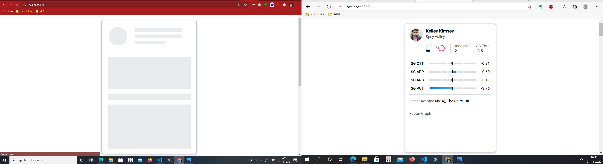

# Golf Player Card APP

Developed a Golf Player Card using React and D3.js Frameworks.
This application is deployed using Google Firebase Database [Player-Card-App](firebase link).

## ScreenShots



## Available Scripts

In the project directory,

- Components Folder which contains all the internal rendering components.
- Provider conatins the Players JSON Data which acts as a context API.
- Styles contains all the components stylings.

## Tasks Completed

### Animations

```bash
Progressive Loading.
Profile Picture Opacity& Hover Scale Up.
Quality Circle Progress.
Ott Graph Progress.
```

### ES6 Destructing JSON Data

```bash
<OttGraph category={sg.SG_Category_Detail}
                  value = {sg[["avg-SG-per-round"]]}
                  arrayValue = {sg}
/>
```

### Context API

```bash
import { StateContext } from './provider/StateProvider';
```

### OTT Graph title & SG numbers Format

```bash
Title Name `SG__TEE` has changed to `SG OTT`.
Avg-SG-PER-ROUND value must have 2 number digits after decimal if not added zero.
```

## Tasks yet to Complete

- Dark Mode Toggle Button.
- Footer Graph (last 10 rounds line chart).

## Challenges

Since D3.js data Visualization framework was new for me. I have done only a little move on it. If I get a chance to work with D3.js on this development will get stick to the framework as quick as possible.

```bash
import { selectAll } from "d3-selection";
```

## Wanted to know more about

- profile picture
- card location
- latest activity

## License

[MIT](https://choosealicense.com/licenses/mit/)
